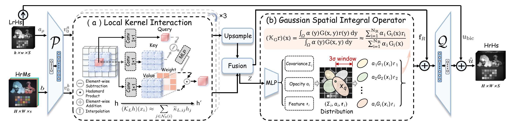

<div align="center">

# Gaussian Spatial-Spectral Neural Operator

### Cross-Scale Spatial-Spectral Fusion with Gaussian Operators

Qinyi Shi, Junwei Zhu, Mouyi Zhang, Honghui Xu, and Jianwei Zheng<sup>†</sup>

Zhejiang University of Technology

<sub>† Corresponding author: [zjw@zjut.edu.cn](mailto:zjw@zjut.edu.cn)</sub>

</div>

<p align="center">
  
  <br>
  <em>Overall architecture of GSNO.</em>
</p>

This repository contains the GSNO model, training scripts, and CAVE and Harvard
cross-scale evaluation code. Datasets and pretrained checkpoints are **not**
included; evaluation requires a compatible checkpoint trained separately.

## Highlights

- GSNO learns a spatial-spectral fusion mapping from LR-HSI and HR-MSI.
- Local Kernel Interaction (LKI) models neighborhood feature relations on the
  observation grid.
- Gaussian Spatial Integral Operator (GSIO) performs density-normalized local
  integration on the HR reference grid.
- One model trained at `4x` is evaluated at `4x`, `8x`, `16x`, and `32x`.

## Repository Layout

```text
GSNO/
├── model/gsno.py                  # GSNO model and reconstruction loss
├── datasets/                      # CAVE and Harvard loaders
├── extensions/                    # CUDA Gaussian rasterizer
├── tools/                         # Metrics and multiscale evaluation
├── scripts/                       # Training and evaluation launchers
├── checkpoints/                   # Checkpoint availability
├── tests/                         # CPU regression tests
├── Train_Cave.py                 # Shared training entry point
├── Train_Harvard.py              # Harvard training wrapper
├── requirements.txt              # Python dependencies
├── CITATION.cff                  # Citation metadata
└── third_party/                  # Provenance and license information
```

The package contains one model entry point, `model.gsno.GSNO`. Experimental
architectures and comparison implementations are not included.

The model can be constructed as follows:

```python
from model.gsno import GSNO

model = GSNO(dim=80, num_bands=31, num_msi=3, adci_layers=3)
```

The code-level argument `adci_layers` names the paper's Local Kernel
Interaction (LKI) stages and is retained to preserve the recorded checkpoint
parameter layout. `GSFusion` is an alias for `GSNO`; both names construct the
same class. The evaluator loads a compatible checkpoint with `strict=True`.

## Installation

The paper model uses PyTorch and a compiled CUDA rasterizer. A compatible
CUDA toolkit with `nvcc`, an NVIDIA GPU, and a C++ compiler are required for
model training and inference.

```bash
git clone https://github.com/QY471/GSNO.git
cd GSNO

conda create -n gsno python=3.10 -y
conda activate gsno
pip install -r requirements.txt

cd extensions/adaptive3_rasterizer
python setup.py build_ext --inplace
cd ../..
```

The extension is compiled in place. CPU-only execution supports the data
utilities and release tests, but not the paper model.

## Data Preparation

The repository does not redistribute CAVE or Harvard. Arrange the datasets as:

```text
<DATA_ROOT>/
├── Cave/
│   ├── Train/
│   │   ├── Train.txt
│   │   ├── HSI/<scene>.mat
│   │   └── RGB/<scene>.mat
│   └── Test/
│       ├── Test.txt
│       ├── HSI/<scene>.mat
│       └── RGB/<scene>.mat
└── Harvard/
    ├── Train/{1.mat, ..., 67.mat}
    └── Test/{1.mat, ..., 10.mat}
```

CAVE uses `HSI/<scene>.mat` with key `hsi` (31 channels) and
`RGB/<scene>.mat` with key `rgb` (3 channels). `Train.txt` and `Test.txt`
contain one matching scene name per line, without the `.mat` suffix. The
recorded split has 20 training scenes and 12 test scenes.

Harvard uses numbered MAT files containing `HS` (`1040 x 1392 x 31`) and
`HRMS` (`1040 x 1392 x 3`). The loader reads files `1.mat` through `67.mat`
for training and `1.mat` through `10.mat` for testing. Its evaluation
protocol uses the top-left `1024 x 1024` region of each scene. These MAT
layouts are the inputs expected by this repository's loaders.

Both datasets require aligned HR-HSI and HR-MSI arrays scaled to `[0, 1]`.
The loaders do not normalize the arrays or generate HR-MSI from the Nikon
D700 spectral response; supply those prepared inputs before training. The
LR-HSI is generated online by Gaussian blurring and downsampling. The exact
CAVE scene lists and the Harvard raw-scene-to-file mapping used for the paper
are not included in this repository. The Harvard loader preloads the 67
training scenes into host memory (about 12.3 GiB for its float32 arrays).

The [SFNO repository](https://github.com/weili419/SFNO) links to a
prepared CAVE dataset. If using that preparation, check its scene names, MAT
keys, dimensions, and split against the layout above; this repository does not
assert that its paper split can be reconstructed from the linked download.

Set `CAVE_ROOT` or `HARVARD_ROOT`, or pass `--data_path` and
`--test_data_path` to the training command.

## Checkpoint Availability

No pretrained weights are included in this repository. The recorded CAVE
run selected epoch `555` with a `4x` PSNR of `52.6838439 dB`. These numbers
describe that specific historical checkpoint; they are not results reproduced
from this source package. See [checkpoints/README.md](checkpoints/README.md)
for the current release status.

## Evaluation

After training, evaluate a frozen checkpoint across fusion ratios. Set the
epoch and selection-scale PSNR to the values recorded for **that same checkpoint**.
For the recorded CAVE `4x` run:

```bash
export DATA_ROOT=/path/to/data
export CHECKPOINT=/path/to/best_model.pth
export BEST_EPOCH=555
export BEST_PSNR=52.6838439
bash scripts/run_eval_cave_cross_scale.sh
```

The `BEST_EPOCH` and `BEST_PSNR` values above are examples from the recorded
CAVE run and apply only to its matching checkpoint. Substitute the metadata
from your own run when evaluating a newly trained checkpoint. The evaluator
checks the supplied `4x` PSNR against its measured value, then reports PSNR,
SAM, ERGAS, SSIM, and per-image results for `4x`, `8x`, `16x`, and `32x` using
the same frozen parameters. For Harvard, run
`scripts/run_eval_harvard_cross_scale.sh` with the corresponding checkpoint,
data root, and recorded `BEST_EPOCH`/`BEST_PSNR`. For a model selected at `8x`,
set `SELECTION_SCALE=8` and `SCALES="8 16 32"` for either script. The selected
scale must be among the evaluated scales. Harvard evaluation uses the top-left
`1024 x 1024` crop implemented by its dataset loader.
The evaluator records the supplied epoch as metadata; the checkpoint file does
not itself encode an epoch that can be independently checked.

## Training

The recorded CAVE configuration is:

| Setting | Value |
|---|---:|
| Dataset | CAVE |
| Training ratio | `4x` |
| Feature dimension | `80` |
| Seed | `1` |
| Epochs | `1000` |
| Evaluation interval | `5` epochs |

```bash
python Train_Cave.py \
  --dataset cave \
  --data_path /path/to/Cave/Train \
  --test_data_path /path/to/Cave/Test \
  --model gsno \
  --sf 4 --dim 80 --ep_total 1000 --e_every 5 \
  --checkpoint_root Checkpoint_CAVE
```

For Harvard, use `Train_Harvard.py` with the corresponding data root. The
training script selects `best_model.pth` using PSNR on `--test_data_path` every
`--e_every` epochs. The provided commands point that path to the `Test`
split, so the same split is used for model selection and reported evaluation.

The shell wrappers in `scripts/` provide the same CAVE and Harvard commands
with environment-variable configuration.
For separately trained `8x` comparisons, run the same training entry point
with `--sf 8` and a separate `--checkpoint_root`, then evaluate that checkpoint
with `SELECTION_SCALE=8`. The `8x`-trained comparison requires that separate
checkpoint.

## Useful Commands

```bash
python -m unittest discover -s tests -v
python tools/check_public_release.py
```

These commands check imports, degradation, loader shapes, documentation links,
model aliases, and tracked-file safety. They do not reproduce the paper PSNR.

## Citation

```bibtex
@misc{shi2026gsno,
  title     = {Gaussian Spatial-Spectral Neural Operator},
  author    = {Shi, Qinyi and Zhu, Junwei and Zhang, Mouyi and Xu, Honghui and Zheng, Jianwei},
  year      = {2026},
  note      = {Unpublished manuscript},
  url       = {https://github.com/QY471/GSNO}
}
```

## License

No license is currently specified for the original GSNO code. The bundled
Gaussian rasterizer is subject to its upstream non-commercial research
license. See [third_party/README.md](third_party/README.md) for component
provenance and license details.
